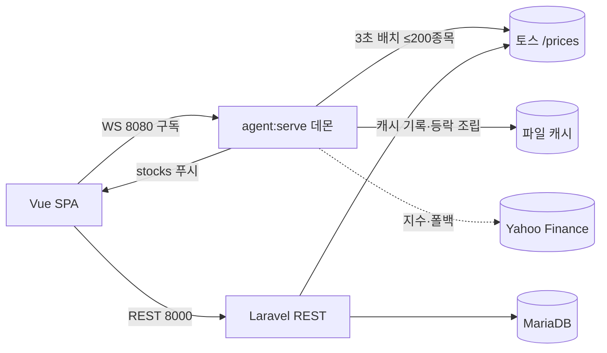

# trading_info

미국·국내 주식을 **3초 주기로 실시간 모니터링**하고, 보유 종목을 **원화로 통합 평가**(주가손익·환율손익 분리)하는 개인용 포트폴리오 트래커. PC 웹 + 모바일 앱(Capacitor).


> ⚠️ **조회·자문 전용** — 주문/매매·실현손익·투자 추천은 하지 않습니다(평가손익만, 면책 표기).

## Quick Start

로컬 단일 사용자 구동. 백엔드 REST · 실시간 WebSocket 데몬 · 프론트 3개 프로세스를 띄운다. (사전: PHP 8.4+, Node 22, MariaDB)

```bash
# 준비 — 의존 설치 · .env 작성(DB_* / TOSS_*) · 마이그레이션
cd backend  && composer install && php artisan migrate
cd frontend && npm install

# 실행 — 3개 프로세스 (각각 별도 터미널)
php artisan serve --port=8000    # 1) REST API
php artisan agent:serve          # 2) 실시간 WebSocket 데몬 (8080, 3초 사이클)
npm run dev                      # 3) 프론트 (Vite, 5173 · HMR)
```

환경설정(`backend/.env`, git 제외): `TOSS_CLIENT_ID`/`TOSS_CLIENT_SECRET`(토스증권 WTS에서 발급) · `DB_*`(MariaDB). API 키·비밀값은 코드/DB에 두지 않고 전부 환경변수로 관리한다.

> 백엔드(`WebSocketAgentServer`·`StockController` 등) 수정 후에는 **WS 데몬(8080) 재시작 필수** — long-running 프로세스라 재시작 전엔 메모리의 옛 코드로 실행된다.

## 주요 기능

| 기능 | 설명 |
|---|---|
| 실시간 시세 모니터링 | 관심·보유·지수 종목을 3초 주기로 갱신(WS 그리드·차트) |
| 원화 통합 포트폴리오 | 미국·국내 보유를 원화로 환산해 평가손익을 **주가손익 vs 환율손익**으로 분리 |
| 차트 조회 | 개별종목 분/일봉 + 지수(나스닥100 선물·코스피), 정규장/시간외 등락 분리 |
| 세션·거래일 판정 | 토스 거래소 캘린더로 장 세션 구분, 휴장일 가짜 봉 생성 방지 |
| 모바일 | 동일 코드베이스를 Capacitor로 앱 패키징(LAN 접속, 호스트 동적 바인딩) |

## Why

외부 시세 소스(토스·Yahoo)는 **push를 주지 않아** 폴링으로 끌어와야 한다. 단일 사용자·로컬 환경에 Pusher/Reverb 같은 브로커를 두는 건 과하다고 판단해, **의존 라이브러리 0으로 순수 PHP `stream_socket_server` WebSocket 데몬을 자작**했다 — 구독 종목을 모아 토스 `/prices` 배치(≤200종목/콜)로 한 번에 조회하고 캐시에 기록한 뒤 접속 클라이언트에 푸시한다. 미국 현재가처럼 여러 경로로 흩어져 조용히 깨지던 로직을 토스 게이트웨이 한 곳으로 수렴시킨 것이 핵심 기술 도전이었다.

## 데이터 흐름 (실시간 배치)



## 기술 스택

| 영역 | 선택 | 이유 |
|---|---|---|
| 백엔드 | Laravel 13 (PHP 8.4) | REST·Eloquent·아티즌 커맨드로 단일 앱에 REST+WS 데몬 공존 |
| 프론트 | Vue 3.5 (순수 JS) · Vite 8 · Tailwind v4 · daisyUI v5 | 경량 SPA·HMR. 단일 사용자라 TS 오버헤드 회피 |
| 차트 | lightweight-charts 5 | 금융 캔들 특화·경량 |
| 실시간 | 순수 PHP Stream Socket WebSocket (8080) | 라이브러리 0으로 배치→캐시→푸시 데몬 자립 |
| 시세 소스 | 토스증권 Open API(주력) + Yahoo(지수) | 배치 200종목/콜·세션 캘린더 내장. 지수는 토스 미제공 → Yahoo |
| 저장소 | 로컬 MariaDB + 파일 캐시 | 보유·이력의 FK 무결성은 DB, 단명 시세·토큰은 캐시 |
| 모바일 | Capacitor | 동일 코드베이스를 앱으로 패키징 |

> **데이터 소스** — 국내·미국 현재가·차트·환율·종목마스터는 **토스증권 Open API**(한국투자증권 API에서 전면 전환), 지수(나스닥100 선물 `NQ=F`·코스피 `^KS11`)와 미국 차트 폴백은 **Yahoo Finance**. 시세 소스 장애에 대비해 **토스 → Yahoo → 24h 캐시** 다단 폴백을 두고, 실패를 조용히 삼키지 않고 `source` 라벨로 데이터 출처를 표기한다.

## 구조 · 문서

```
backend/app/Services/Toss/   토스 API 게이트웨이(토큰·배치시세·차트·환율·마스터)
backend/app/Services/Quote/  포트폴리오 평가가(국내·미국)
backend/app/Services/MarketSessionService.php  장 세션·거래일 판정
backend/app/Http/Controllers/StockController.php  시세·차트·지수 REST
frontend/src/                Vue SPA (그리드·차트·포트폴리오)
```

- 포트폴리오 트래커 적응 설계: [`docs/portfolio-tracker-adaptation.md`](docs/portfolio-tracker-adaptation.md) · 원본 빌드 스펙: [`docs/portfolio-tracker-buildspec.html`](docs/portfolio-tracker-buildspec.html)
- 진행 로그: [`docs/progress.html`](docs/progress.html)

## 개발 방식

이 프로젝트는 역할별 AI 에이전트 팀(기획·백엔드·프론트엔드·QA·리뷰·보안)을 직접 구성·운영하는 [AI Agent Workspace](https://github.com/muhwa91/ai-agent-workspace) 거버넌스 아래에서 개발·유지보수됩니다 — API 계약 동결 후 병렬 구현(Contract-First), 훅 기반 품질 게이트, 비공개 모노레포 → 공개 미러 워크플로우.
